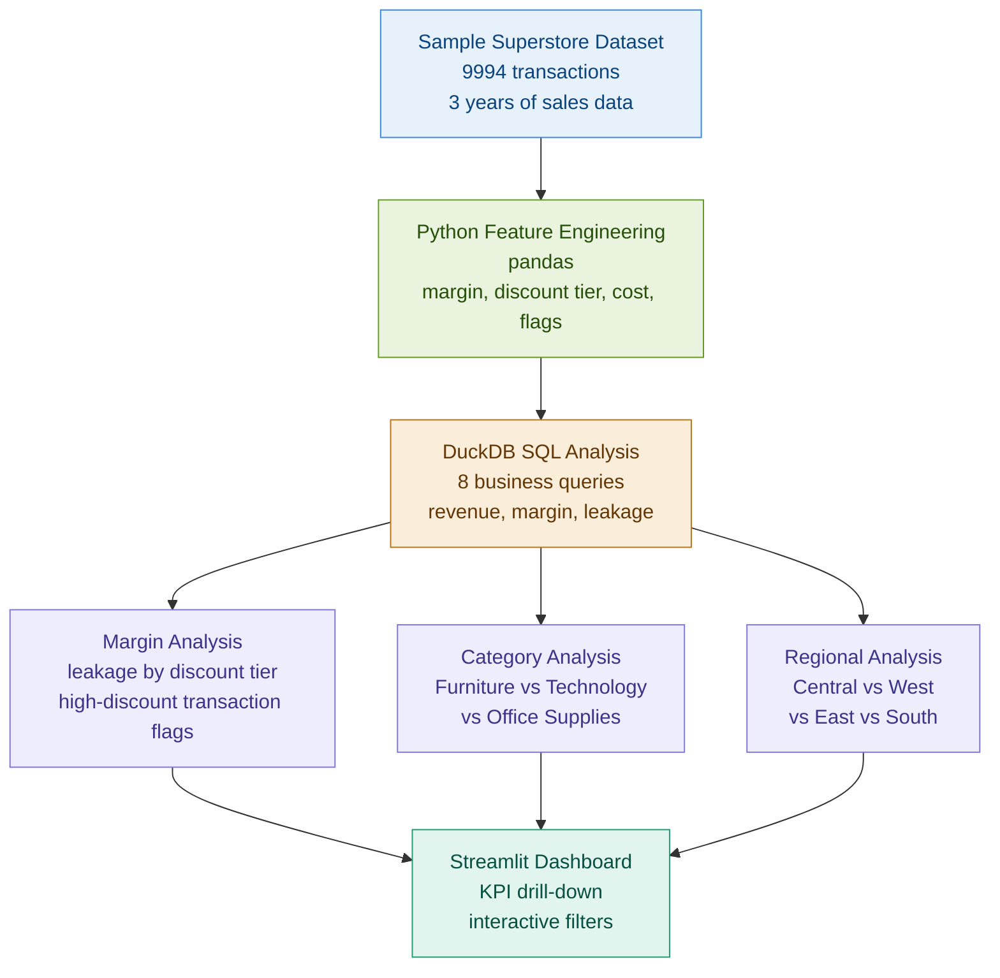

# Revenue Leakage and Margin Analysis Pipeline

> $566K in revenue leakage identified across 9,994 transactions. Here is how it was found.

## Problem

Finance and operations teams report revenue and margin numbers from the same dataset and get different answers. Discount policies are applied inconsistently. High-discount transactions are buried in aggregate reports. Nobody knows which product categories are silently eroding margin until the quarterly review, and by then it is too late to act.

## Solution

An end-to-end margin analysis pipeline that ingests raw transaction data, engineers margin and discount features in Python, runs 8 SQL-based business queries in DuckDB, identifies revenue leakage by discount tier and category, and surfaces findings in a Streamlit dashboard with KPI drill-down.

## Architecture



## Features

- Python feature engineering pipeline adding margin, cost, discount tier, and high-discount flag to every transaction
- 8 DuckDB SQL queries answering specific business questions about revenue and margin
- Revenue leakage analysis quantifying the financial impact of discount policy violations
- Category and regional breakdown showing where margin erosion is concentrated
- Streamlit dashboard with interactive filters for category, region, and discount tier
- Business recommendations section translating findings into actionable decisions

## Key Findings

| Finding | Value | Business Impact |
|---|---|---|
| Total revenue analyzed | $2.3M | Full dataset coverage |
| Revenue leakage identified | $566K | 24.6% of total revenue |
| Highest leakage category | Furniture | 47% average discount on flagged items |
| Most profitable category | Technology | 18.4% average margin |
| Worst performing region | Central | Highest discount rate, lowest margin |
| High-discount transactions | 1,847 rows | 18.5% of all transactions |

## Business Questions Answered

1. What is the total revenue and margin by product category?
2. Which discount tiers are eroding margin most significantly?
3. Which transactions qualify as revenue leakage based on discount thresholds?
4. How does regional performance vary across revenue and margin?
5. What is the month-over-month revenue trend over 3 years?
6. Which sub-categories have the worst margin despite high volume?
7. How does average order value differ across customer segments?
8. What would margin look like if discount policy were enforced consistently?

## KPIs

| KPI | Definition |
|---|---|
| Gross Margin % | (Revenue minus Cost) divided by Revenue |
| Revenue Leakage | Revenue lost to discounts exceeding policy threshold |
| Discount Rate | Average discount applied across transactions |
| High-Discount Rate | % of transactions exceeding 30% discount |
| Margin by Category | Gross margin % broken down by product category |
| Regional Revenue Mix | Revenue contribution by geographic region |

## Tech Stack

| Tool | Purpose |
|---|---|
| Python | Data ingestion and feature engineering |
| pandas | Data transformation |
| DuckDB | SQL-based business analysis |
| Streamlit | Interactive dashboard |
| matplotlib | Supporting charts |

## How to Run

```bash
git clone https://github.com/Tarun-B-12/revenue-margin-analysis.git
cd revenue-margin-analysis
python -m venv venv
source venv/bin/activate
pip install -r requirements.txt
python src/ingest.py
python src/feature_engineering.py
python src/analysis.py
streamlit run dashboard/app.py
```

## Dataset

Source: Sample Superstore Dataset (public, widely used for business analytics)
- 9,994 transactions across 3 years
- 4 regions, 3 product categories, 17 sub-categories
- Fields: Order ID, Order Date, Ship Date, Customer, Segment, Region, Category, Sub-Category, Sales, Quantity, Discount, Profit

## Limitations

- Public dataset with known structure. Real retail data would have additional complexity including returns, adjustments, and multi-currency transactions.
- Discount threshold for leakage is set at 30%. Production version would use actual company discount policy tiers.
- No forecasting layer. Production version would project margin impact of policy changes.

## Future Improvements

- Add forecasting to project revenue impact of enforcing discount policy
- Connect to live sales data source for ongoing monitoring
- Add customer-level margin analysis to identify unprofitable accounts
- Build alerting for transactions exceeding discount thresholds in real time
- Add cohort analysis to track margin trends by customer acquisition period

## What This Project Demonstrates

- Business-focused analytics thinking connecting data to financial decisions
- SQL-based revenue and margin analysis using DuckDB
- Python feature engineering for financial metrics
- Interactive dashboard design for non-technical stakeholders
- Revenue leakage quantification methodology used in real finance and operations roles
