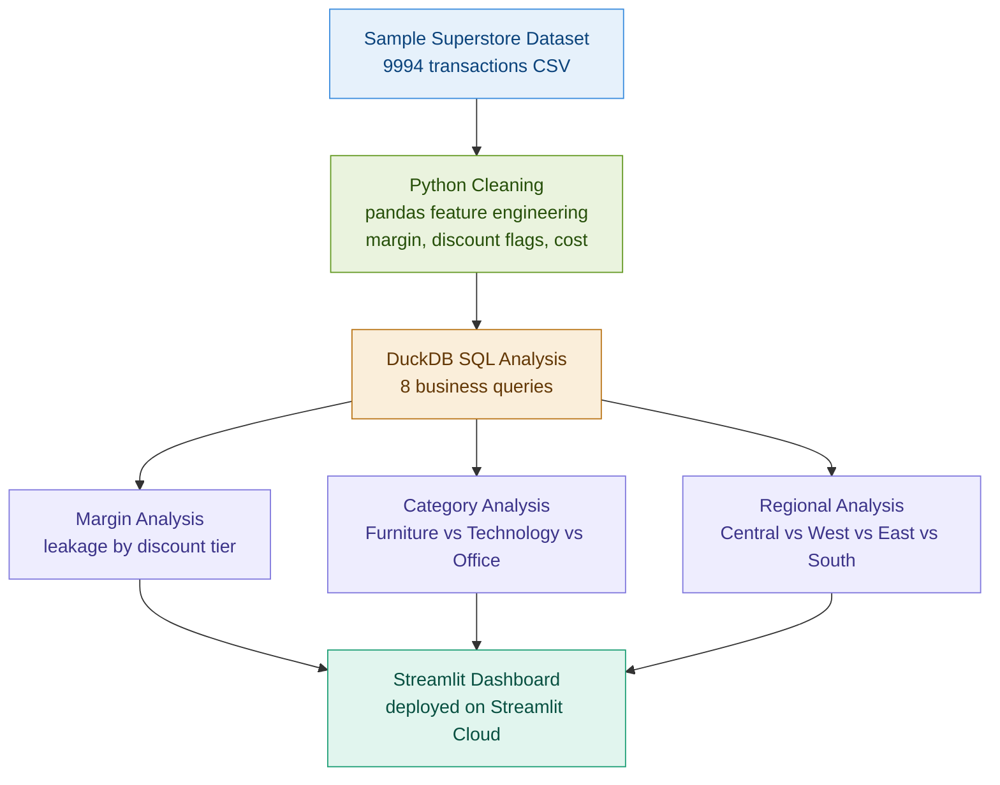
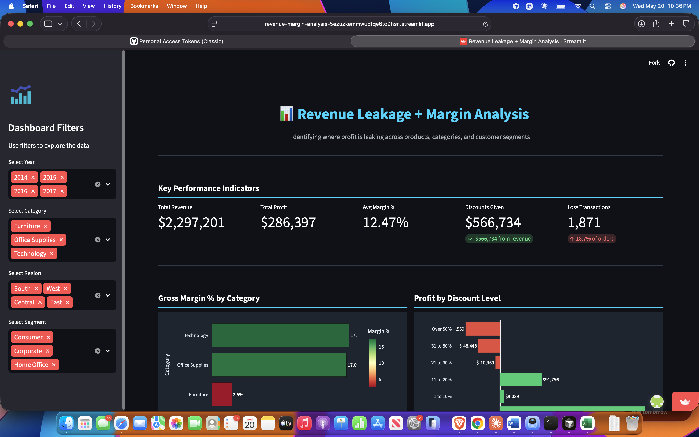
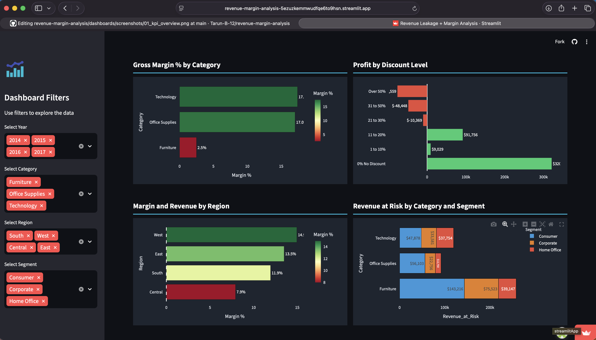
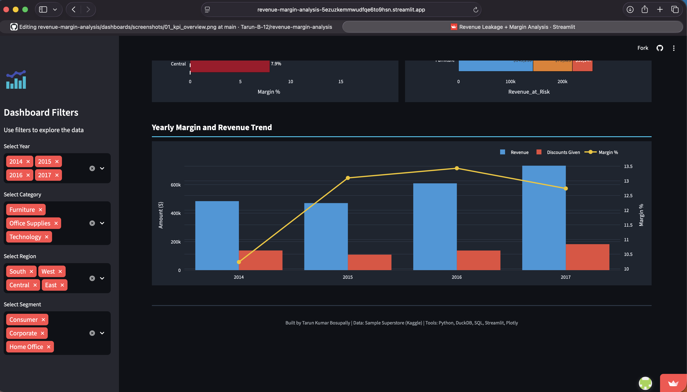

# Revenue Leakage + Margin Analysis

## Live Dashboard
Interactive dashboard deployed on Streamlit Cloud:
https://revenue-margin-analysis-5ezuzkemmwudfqe6to9hsn.streamlit.app/

## GitHub Repository
https://github.com/Tarun-B-12/revenue-margin-analysis

## One-Line Summary
End-to-end margin analysis identifying $566k in revenue leakage across 9,994 transactions using Python, DuckDB, SQL, Streamlit, and Plotly.

## Business Problem
Many companies lose significant profit through excessive discounting, unprofitable product lines, and poorly targeted customer segments without realizing where the leakage is happening.

This project analyzes 9,994 retail transactions to identify exactly where margin is being lost, which discount thresholds destroy profitability, and which product categories and segments need immediate pricing attention.

## Target Stakeholder
- Sales Director
- Finance Manager
- VP of Operations
- Revenue Manager

## Tools Used
- Python with pandas for data loading, cleaning, and feature engineering
- DuckDB for in-memory SQL analysis engine
- SQL for business analysis queries
- Streamlit for interactive web dashboard
- Plotly for data visualizations
- GitHub for version control and portfolio showcase

## Dataset
- Source: Sample Superstore Dataset from Kaggle
- Records: 9,994 transactions
- Period: 2014 to 2017
- Fields: Orders, customers, products, sales, profit, discount, region, segment, category
- Note: Public dataset used for portfolio purposes. All metrics are project-level.

## Key Business Questions
1. What is the overall margin and where is profit leaking?
2. Which product categories are most and least profitable?
3. How much are discounts hurting margin?
4. Which customer segments drive the most and least profit?
5. Which specific sub-categories are actively losing money?
6. Which regions are underperforming on margin?
7. How has margin trended year over year?

## KPIs
| KPI | Definition | Why It Matters |
|---|---|---|
| Gross Margin % | Profit divided by Sales multiplied by 100 | Core profitability measure |
| Total Revenue | Sum of all sales | Business scale |
| Total Profit | Sum of all profit | Actual earnings |
| Discount Rate % | Discount divided by Original Price multiplied by 100 | Pricing discipline |
| Loss Transactions | Count of orders where Profit is below zero | Risk exposure |
| Revenue at Risk | Revenue from transactions below 10% margin | Leakage opportunity |
| Discount Amount | Total dollar value of discounts given | Cost of discounting |

## Project Architecture

## Data Cleaning and Validation
- Converted Order Date and Ship Date from string to datetime format
- Extracted year, month, quarter from order dates for time analysis
- Added Gross Margin % column calculated as Profit divided by Sales
- Added Cost column calculated as Sales minus Profit
- Added Discount Amount in dollars
- Flagged loss transactions where Profit is below zero
- Flagged high discount transactions where Discount is above 30%
- Flagged low margin transactions where Gross Margin % is below 10%
- Verified zero missing values across all 21 columns
- Verified zero duplicate rows across 9,994 transactions

## Key Findings

### Finding 1: Discounts Exceed Earnings
The business gave away $566,734 in discounts while earning only $286,397 in profit. Discounting is outpacing profitability.

### Finding 2: Discount Rate Destroys Margin
| Discount Level | Margin |
|---|---|
| No Discount | +29.51% |
| 1 to 10% | +16.61% |
| 11 to 20% | +11.58% |
| 21 to 30% | -10.05% |
| 31 to 50% | -24.80% |
| Over 50% | -119.20% |

Any discount above 20% results in negative margin.

### Finding 3: Furniture Is a Loss Leader
Furniture generated $742k in revenue but only $18k in profit, a 2.49% margin. Tables alone lost $17,725 with 63% of transactions unprofitable.

### Finding 4: Segment Profitability Gap
| Segment | Margin |
|---|---|
| Home Office | 14.03% |
| Corporate | 13.03% |
| Consumer | 11.55% |

Consumer is the largest segment but the least profitable.

### Finding 5: Central Region Is Underperforming
| Region | Margin | Avg Discount |
|---|---|---|
| West | 14.94% | 10.93% |
| East | 13.48% | 14.54% |
| South | 11.93% | 14.73% |
| Central | 7.92% | 24.04% |

Central region has a 24% average discount rate versus 11% in West. Over-discounting is directly responsible for the margin gap.

### Finding 6: Discounts Growing Faster Than Revenue
2017 had the highest revenue at $733k but margin dropped from 2016. Discounts jumped to $182k in 2017, the highest ever, buying revenue at the cost of margin.

## Business Recommendations
1. Set a hard discount cap at 20% because any discount above this level produces negative margin
2. Reprice or discontinue the Tables sub-category since 63% of transactions lose money
3. Prioritize Home Office and Corporate segments over Consumer for high value deals
4. Audit Central region sales team discounting practices immediately
5. Review Furniture category pricing strategy since 2.49% margin is not sustainable

## Dashboard Screenshots

### KPI Overview

### Category and Discount Analysis

### Regional and Leakage Analysis

## What This Project Demonstrates
- Business problem framing and stakeholder thinking
- Python data cleaning and feature engineering with pandas
- SQL analysis using DuckDB across 8 business queries
- KPI definition and metric design
- Revenue leakage identification methodology
- Interactive dashboard development with Streamlit and Plotly
- Cloud deployment on Streamlit Cloud
- GitHub documentation and portfolio packaging

## Limitations
- Dataset is sample retail data from Kaggle and not from a real company
- Metrics are project level and based on public data
- No seasonality or external market data included
- Cost structure is derived from Sales minus Profit
- No statistical significance testing on findings

## Repository Structure

    revenue-margin-analysis/
      data/
        raw/
        processed/
      notebooks/
      sql/
      src/
        dashboard.py
      dashboards/
        screenshots/
      docs/
        data_dictionary.md
      README.md
      requirements.txt

## Next Improvements
- Add forecasting layer to predict future margin by category
- Add automated data refresh pipeline
- Add dbt models for production-grade transformations
- Add statistical significance testing on discount impact
- Add email alert when margin drops below threshold
